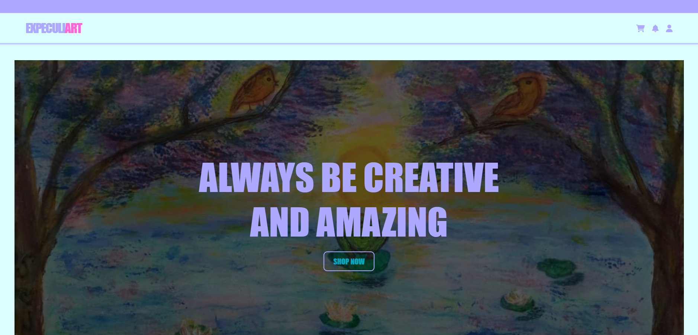

# Expeculiart

 

A responsive front-end website based on a friend's art business. This project was rebuilt from one of my sophomore-year college projects to practice responsive web design and improve my front-end development skills.

**Website:** https://expeculiart.vercel.app/

---

## About

Expeculiart is a responsive front-end website based on a friend's art business. It showcases artworks, sticker collections, and custom tote bag designs through a simple and clean user interface.

This project is a remake of one of my college projects that I originally created during my sophomore year. I rebuilt it from scratch using HTML and CSS to apply what I have learned in responsive web design and to improve the overall layout, code structure, and user experience.

---

## Features

- Responsive layout for desktop, tablet, and mobile devices
- Hero section with a call-to-action button
- Product gallery for artworks and stickers
- Custom tote bag section with a link to the business's Instagram page
- Instagram gallery showcasing selected artworks
- Hover effects for products and images
- Social media links in the footer
- Smooth scrolling navigation

---

## Technologies Used

- HTML5
- CSS3
- Font Awesome
- Git
- GitHub
- Vercel

---

## Note

This is a front-end project only. The website does not include shopping cart functionality, user accounts, or payment processing. Buttons such as **Add to Cart** are included for layout and design purposes only.

---

## Deployment

This project is deployed using **Vercel** and version controlled with **Git** and **GitHub**.

---

## Author

**Kim Macapayad**
Computer Engineering Graduate from the Philippines

Portfolio:
https://kcmacapayad-portfolio.vercel.app

---

## License

This project is for educational and portfolio purposes only.

The artworks, branding, and other media belong to their respective owner. This repository contains only the front-end implementation of the website.
